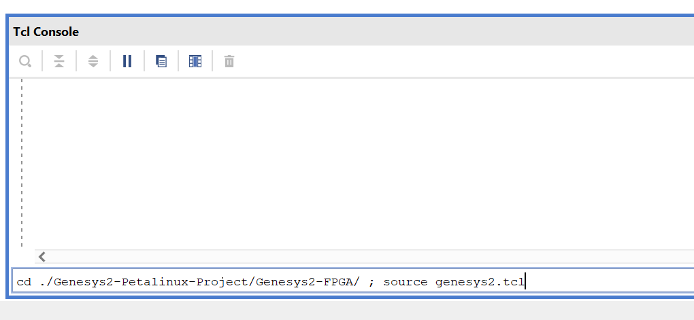
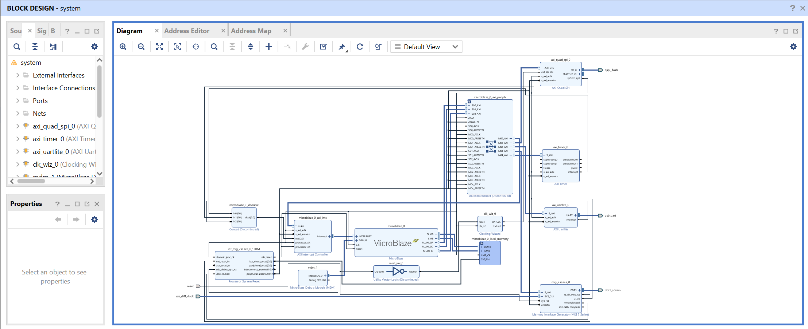
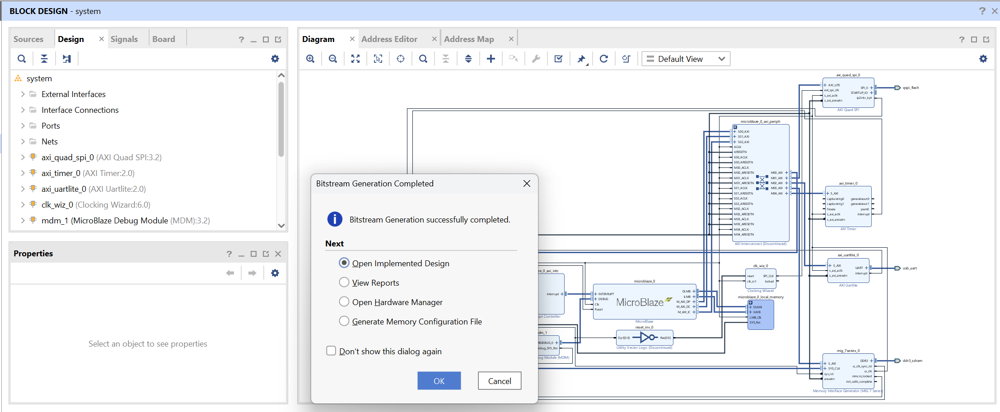
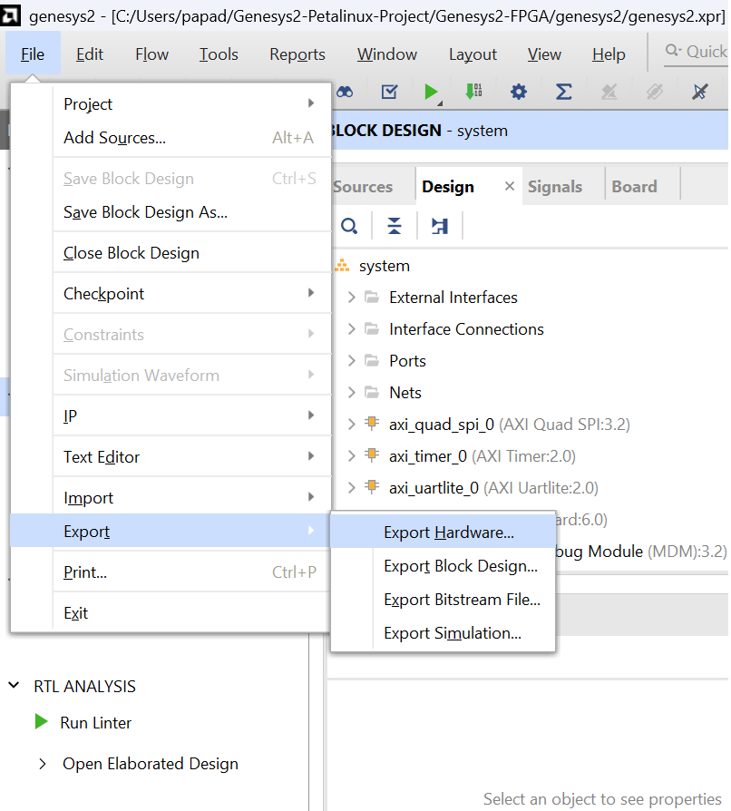
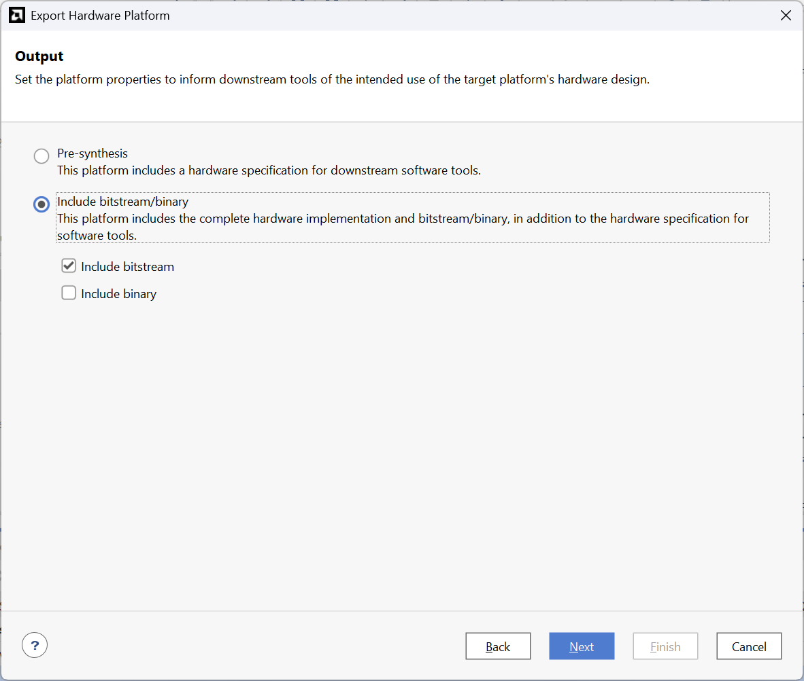

<a id="readme-top"></a>

[![Contributors][contributors-shield]][contributors-url]
[![Forks][forks-shield]][forks-url]
[![Stargazers][stars-shield]][stars-url]
[![Issues][issues-shield]][issues-url]


<br />
<h3 align="center">Genesys 2 Kintex-7 Petalinux FPGA</h3>

  <p align="center">
    This is the fpga design for the Petalinux build on the Genesys 2
    Kintex-7 from Digilent based on Vivado 2025.1
  </p>

  > [!WARNING]
  > This is only the FPGA project side of Petalinux and will not build it !!!. It only generates the necessary files for Petalinux which are the bitstream and the exported hardware. Therefore this is not the main repo that is used to generate Linux. In fact, this repo is only a submodule for the main one that holds the Petalinux Project. Please refer to the
  [Genesys2 Petalinux Project](https://github.com/Bodanor/Genesys2-Petalinux-Project) repo in oder to buld Petalinux !

  <p align="center">
    <a href="https://github.com/Bodanor/Genenys2-PetaLinux-Microblaze-FPGA-Design/issues/new?labels=bug&template=bug-report---.md">Report Bug</a>
    &middot;
    <a href="https://github.com/Bodanor/Genenys2-PetaLinux-Microblaze-FPGA-Design/issues/new?labels=enhancement&template=feature-request---.md">Request Feature</a>

  </p>
<!-- TABLE OF CONTENTS -->
<details>
<summary>Table of Contents</summary>
  <ol>
    <li><a href="#about-the-project">About The Project</a></li>
    <li>
      <a href="#getting-started">Getting Started</a>
      <ul>
        <li><a href="#prerequisites">Prerequisites</a></li>
      </ul>
    </li>
    <li><a href="#generating-the-project">Generating the project</a></li>
    <li>
      <a href="#export-the-hardware">Export the Hardware</a>
      <ul>
        <li><a href="#steps-to-export-the-hardware">Steps to export the hardware</a></li>
      </ul>
    </li>
    <li><a href="#results">Results</a></li>
    <li>
      <a href="#roadmap">Roadmap</a>
      <ul>
        <li><a href="#ip-cores-implemented">IP Cores implemented</a></li>
        <li><a href="#planned">Planned</a></li>
      </ul>
    </li>
    <li><a href="#contributing">Contributing</a></li>
    <li><a href="#contact">Contact</a></li>
  </ol>
</details>


<!-- ABOUT THE PROJECT -->
## About The Project

![alt text][product-screenshot]

The goal of this project is for developers to be able to generate a base design for the board that should make Linux boot. From that point, developers are free to do whatever comes to their mind.

Right above, you should see a screenshot of what the tcl script should produce (can change with future versions).

> [!NOTE]
> This project does not (yet) have Ethernet in the design, meeaning users do not need to have a license for the ethernet CORE IP.
<p align="right">(<a href="#readme-top">back to top</a>)</p>

<!-- GETTING STARTED -->
## Getting Started

If you don't want to generate the project, you reading journey stops here as for each release, the bitstream, memory map and the exported hardware file needed for petalinux to be built is provided in the [release-tab]. Feel free to download those if you don't want to make modifications to the design. 

For the others, follow the instructions bellow to generate the project in order to have a bitstream, memory map and the exported hardware files.

### Prerequisites


* **<ins>Vivado 2025.1 Design suite** </ins>
  
  In order to have a design and to generate the project, the developer must have Vivado 2025.1 Design suite install on it's computer. Now, if that's not possible, feel free to open an issue and propose a solution or I'll see what I can do about it. Unfortunately, the Genesys 2 kintex-7 has an FPGA that uses the priced Vivado suite :(

* **<ins>Having the Digilent board files installed in Vivado for the Genesys 2 Kintex-7** </ins>

  Digilent provides boards files to ease the design inside Vivado. Yes this makes it easier for sure, but in that case we only need those boards files for the constraint files. Later on, I'll probably include the constraints in a seperate files inside the project but for now, vivado uses the one provided by digilent in the board files.

  In order to install those, download or clone the [digilent board repo file](https://github.com/Digilent/vivado-boards). Then copy all eveything that is inside the **new/boards_files** folder to :
  ```
    <base_vivado_install_dir>/data/xhub/boards/XilinxBoardStore/boards/Xilinx
  ```

## Generating the Project

1. Clone the repo using HTTPS or SSH
   ```sh
   # HTTPS
   git clone https://github.com/Bodanor/Genenys2-PetaLinux-Microblaze-FPGA-Design.git
   # SSH
   git clone git@github.com:Bodanor/Genenys2-PetaLinux-Microblaze-FPGA-Design.git
   ```
2. Launch Vivado

3. Generate the design by opening the tcl console at the bottom and write the following :

   ```bash
    cd <path_to_where_this_repo_has_been_cloned> ; source genesys2.tcl
   ```
   
   What that does is telling Vivado to change directory to where this project has been cloned and source the main tcl script that generated the project.

4. Wait for the design to be placed in the diagram
  
5. Genereate the bitstream, take a long coffee break and wait for confirmation !

   Click on the <ins>**Generate Bitstream**</ins> button on the left side in the flow menu. If everything goes well, you should see a confirmation dialog. Click on **Cancel**
  

<p align="right">(<a href="#readme-top">back to top</a>)</p>


<!-- USAGE EXAMPLES -->
## Export the hardware

In order for petalinux to be build, it needs to have a way to know what hardware it can use. The way we do this is by exporting the hardware, a little file (.xsa) that contains all the information petalinux needs in order to build Linux !

### Steps to export the hardware
Click on the top menu **File** -> **Export** --> **Export hardare**


A new window should appear asking you what the output should contain. In our case, we want petalinux to have access to the bitstream also. Therefore, we must toggle the **include bitstream/binary** button and click on next. You can give it whatever name you want



## Results

We are now done. In fact, inside the folder where you cloned this repository, you should now see a file called **<the_name_provided_in_the_last_step>.xsa**. This is the only file that Petalinux needs to import in order to build linux and create the .MCS file containing all the images needed to boot Linux *(FSBL, U-boot, Kernel, rootfs, Device-tree)*

<p align="right">(<a href="#readme-top">back to top</a>)</p>


<!-- ROADMAP -->
## Roadmap

### <ins> IP Cores implemented 
- [X] Microblaze Processor (needed)
- [X] MIG7 DDR3 controller (needed)
- [X] AXI Timer (needed)
- [X] UartLite 115200 Baud speed (Optional, not recommanded)
- [X] AXI Quad SPI (Optional)

### <ins> Planned
- [ ] Add Ethernet IP Core
- [ ] Add second Microblaze processor for multi core

See the [open issues](https://github.com/Bodanor/Genenys2-PetaLinux-Microblaze-FPGA-Design/issues) for a full list of proposed features (and known issues).

<p align="right">(<a href="#readme-top">back to top</a>)</p>


<!-- CONTRIBUTING -->
## Contributing

Any controbution to this project is very much appreciated. Please don't hesitate to fork this and create a pull request. Same goes for any issues. 

<p align="right">(<a href="#readme-top">back to top</a>)</p>

### Top contributors:

<a href="https://github.com/Bodanor/Genenys2-PetaLinux-Microblaze-FPGA-Design/graphs/contributors">
  
</a>

<!-- CONTACT -->
## Contact
[Christos Papadopoulos][linkedin-url] - papadopoulos.chris@icloud.com

Project Link: [https://github.com/Bodanor/Genenys2-PetaLinux-Microblaze-FPGA-Design](https://github.com/Bodanor/Genenys2-PetaLinux-Microblaze-FPGA-Design)

<p align="right">(<a href="#readme-top">back to top</a>)</p>


<!-- MARKDOWN LINKS & IMAGES -->
<!-- https://www.markdownguide.org/basic-syntax/#reference-style-links -->
[contributors-shield]: https://img.shields.io/github/contributors/Bodanor/Genenys2-PetaLinux-Microblaze-FPGA-Design.svg?style=for-the-badge
[contributors-url]: https://github.com/Bodanor/Genenys2-PetaLinux-Microblaze-FPGA-Design/graphs/contributors
[forks-shield]: https://img.shields.io/github/forks/Bodanor/Genenys2-PetaLinux-Microblaze-FPGA-Design.svg?style=for-the-badge
[forks-url]: https://github.com/Bodanor/Genenys2-PetaLinux-Microblaze-FPGA-Design/network/members
[stars-shield]: https://img.shields.io/github/stars/Bodanor/Genenys2-PetaLinux-Microblaze-FPGA-Design.svg?style=for-the-badge
[stars-url]: https://github.com/Bodanor/Genenys2-PetaLinux-Microblaze-FPGA-Design/stargazers
[issues-shield]: https://img.shields.io/github/issues/Bodanor/Genenys2-PetaLinux-Microblaze-FPGA-Design.svg?style=for-the-badge
[issues-url]: https://github.com/Bodanor/Genenys2-PetaLinux-Microblaze-FPGA-Design/issues
[product-screenshot]: images/Block_design.png
[release-tab]: https://github.com/Bodanor/Genenys2-PetaLinux-Microblaze-FPGA-Design/releases
[linkedin-shield]: https://img.shields.io/badge/-LinkedIn-black.svg?style=for-the-badge&logo=linkedin&colorB=555
[linkedin-url]: https://www.linkedin.com/in/christos-papadopoulos-a715392a5/